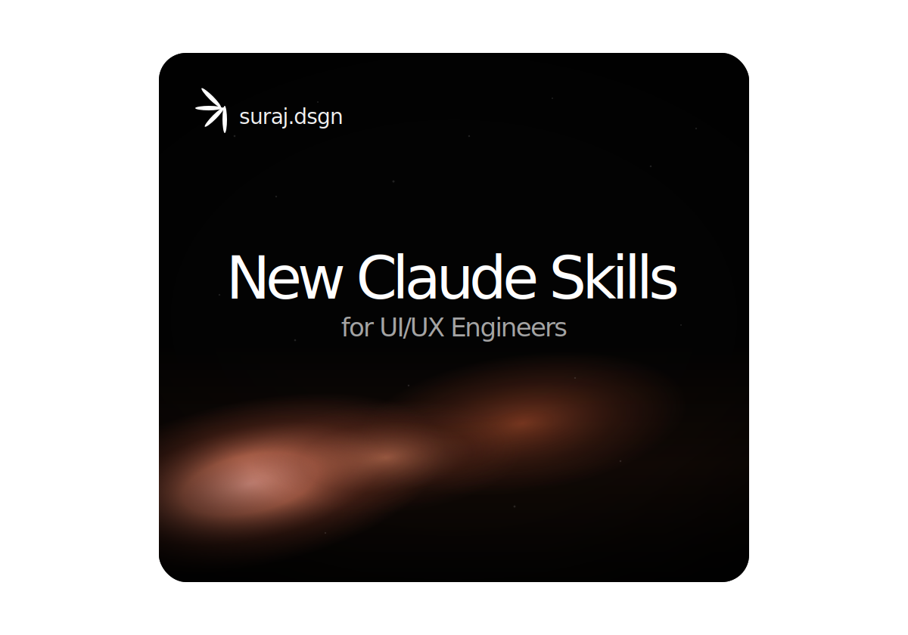

# Claude Skills Card UI



A sleek **single-file HTML/CSS/JavaScript card UI** inspired by Claude Skills.

The project lives in one file: [`claude-skills-card-ui.html`](./claude-skills-card-ui.html).  
It creates an interactive 3D card with a dark premium look, glowing gradient shader, subtle grain texture, Claude-style mark, and mouse-follow tilt animation.

## Features

- Single-file HTML project
- 3D tilt interaction on mouse move
- Cursor-follow highlight effect
- Dark premium card design
- Orange/red glowing shader background
- Subtle noise texture overlay
- Vignette depth effect
- Responsive layout
- No dependencies

## Tech Stack

- HTML
- CSS
- JavaScript

## File Structure

```text
claude-skills-card-ui/
├── assets/
│   └── claude-skills-card-preview.svg
├── claude-skills-card-ui.html
└── README.md
